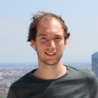

---
# Feel free to add content and custom Front Matter to this file.
# To modify the layout, see https://jekyllrb.com/docs/themes/#overriding-theme-defaults

layout: home
title: About
exclude: true
---
<!--  -->

My name is **Samuel Murray** and I am a PhD student in Machine Learning at KTH Royal Institute of Technology, Stockholm, Sweden.

My research is about probabilistic models, and how prior knowledge can be used in model design.